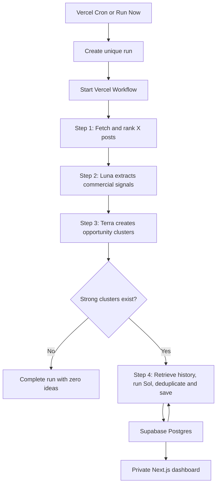

# Lean Full Blueprint

This version uses **JavaScript throughout**—no Convex, Zod, TypeScript, ORM, Redis, LangChain, separate vector database, or multi-agent framework.

The original architectural rule remains the right one:

> **The database owns memory. Models receive only the current evidence and relevant historical ideas.**

That keeps the system reproducible and prevents model context from becoming an unreliable source of state.

---

## Approved version-one amendments — August 28, 2026

These user-approved changes supersede narrower or conflicting statements later in this blueprint. All other architecture, evidence, security, retention, deduplication, and acceptance rules remain in force.

### Owner access

Supabase Auth remains the authentication system and `OWNER_USER_ID` remains the final authorization boundary. The primary returning-owner flow is now email and password so access does not depend on email delivery. Magic link remains available as a one-time setup and recovery fallback. An authenticated owner can set or change the password from Settings; a non-owner Supabase session must be rejected and cleared.

### Hybrid X discovery and source inspection

The editable topic query remains the broad discovery lane. Settings may also contain up to 12 X usernames for a preferred-account lane.

1. Preferred-account search must still be constrained to AI-relevant language and exclude reposts.
2. Preferred-account posts must pass the view-first reach and response-quality gate before selection.
3. Qualifying preferred-account posts may fill at most half of the posts sent to signal extraction. This is a ceiling, not a quota.
4. Topic discovery fills every unused slot. If preferred accounts have no qualifying posts, the run behaves like the topic-only pipeline.
5. Both lanes share the deterministic ranking, deduplication, persisted candidate limit, evidence rules, and raw-content retention policy. The preferred-account probe may retrieve up to half the AI input limit in addition to the topic budget so preferred posts that fail quality never reduce topic discovery; no more than the configured candidate limit is retained or ranked.
6. `run_posts` records whether a post came from the `followed` or `topic` lane.
7. The private `/posts` page shows the stored X text, author, direct link, public quality-metric snapshot, deterministic selection state, and any later model signal. It must label raw X content separately from model interpretation.

### View-first X quality ranking

The engagement formula in section 5.5 is replaced by a view-first quality model. X post impressions are presented as views, replies as comments, and bookmarks as saves. Repost and quote counts must not be stored in new run snapshots, displayed as quality metrics, or influence any gate, score, or tie-break. Repost posts themselves remain excluded from discovery.

For every candidate, calculate an age-adjusted logarithmic signal for views, comments, likes, and saves. Convert each signal to a percentile within the current candidate pool and calculate the deterministic score as:

```text
65% view percentile
20% comment percentile
10% like percentile
 5% save percentile
```

An all-zero metric contributes zero rather than a median percentile. X result position is retained for source inspection but does not contribute to quality.

Preferred-account posts must also pass an absolute reach gate. With age clamped from two to 168 hours:

```text
adjusted views = views / age^0.55
support = 4 × comments + likes + 0.25 × saves
```

The post passes when adjusted views are at least 750, or when adjusted views are at least 250 and support is at least 10. Age is measured at the start of the X metric fetch, including on workflow retries. A missing view count does not pass the preferred-account gate; topic discovery remains the fallback. Missing public metrics are stored as unavailable rather than silently presented as zero.

### Self-serve AI website opportunity contract

Final ideation now targets self-serve web products, including products that save users time, help users make or retain money, support remote work, serve concrete LATAM needs without relying on translation, replace an expensive or complicated incumbent service, or give businesses a repeatable distribution or social-content advantage. These are soft directions: evidence and quality decide what is published, and no archetype receives a guaranteed slot.

Every published idea must pass all of these hard gates:

* Deliverable through a website, without hardware.
* No healthcare, therapy, medical-adjacent, synthetic-companion, or generic-chatbot product.
* No consulting, agency, audit, workshop, or custom-implementation delivery.
* No enterprise product that depends on a long sales process.
* A credible one-developer MVP in roughly two to six weeks.
* The customer receives the core value without booking a call.
* A concrete time, money, information, or distribution advantage.
* A plausible recurring-use reason.
* Any conversational interface must serve a specific audience and action with a defensible distribution advantage; “chat with AI” is not the product.

Ideas that fail a hard gate are discarded before publication. The final model and JavaScript validator may return zero ideas; neither may add a weak idea merely to fill a slot.

---

## 1. Product definition

The application is a private, single-user research dashboard that runs once per day and:

1. Retrieves recent, relevant AI discussions from X.
2. Removes low-value and repetitive posts.
3. Extracts commercially meaningful problems, requests, workarounds, spending signals, and enabling capabilities.
4. Groups related signals into evidence-backed opportunity themes.
5. Generates **zero to three** business or service ideas.
6. Prevents repeated ideas using fingerprints and embeddings.
7. Records which ideas the user saves, rejects, or tests.
8. Uses that feedback when generating future ideas.

The system must be allowed to produce **zero ideas**. A weak day should produce an empty report rather than fabricated opportunities.

### Evidence scope

For version one, “evidence-backed” means backed by actual X posts from multiple independent authors. It does **not** mean that market size, competitors, pricing, or customer willingness to pay have been independently verified outside X.

Every generated idea is therefore a **commercial hypothesis with supporting evidence**, not a proven market.

---

# 2. Final technology stack

| Layer             | Choice                                |
| ----------------- | ------------------------------------- |
| Application       | Next.js App Router                    |
| Language          | JavaScript and JSX                    |
| Styling           | Tailwind CSS                          |
| Hosting           | Vercel                                |
| Scheduling        | Vercel Cron                           |
| Durable execution | Vercel Workflows                      |
| Database          | Supabase Postgres                     |
| Authentication    | Supabase Auth                         |
| Database access   | `@supabase/supabase-js`               |
| Vector similarity | Supabase `pgvector`                   |
| X data            | Official X API v2                     |
| AI                | Official OpenAI JavaScript SDK        |
| AI API            | Responses API with manual JSON Schema |
| Embeddings        | `text-embedding-3-small`              |

Supabase provides a full Postgres database and supports the `pgvector` extension, so no separate vector service is necessary. ([Supabase][1])

Vercel Workflows remains in the architecture because the pipeline contains several paid external calls and may take several minutes. Workflows provide durable JavaScript execution, resumable steps, and retries. This replaces the need for a separate queue or worker service. ([Vercel][2])

The model allocation is:

| Task                         | Model                    | Reasoning      |
| ---------------------------- | ------------------------ | -------------- |
| Commercial signal extraction | `gpt-5.6-luna`           | Low            |
| Opportunity clustering       | `gpt-5.6-terra`          | Medium         |
| Final business ideation      | `gpt-5.6-sol`            | High           |
| Similarity and deduplication | `text-embedding-3-small` | Not applicable |

OpenAI currently positions Luna for high-volume cost-sensitive work, Terra for the balance of intelligence and cost, and Sol for complex reasoning. ([OpenAI Developers][3])

---

# 3. Lean architecture



There are only **four durable workflow steps**:

1. Fetch and rank.
2. Extract signals.
3. Build clusters.
4. Generate, deduplicate, and save ideas.

Do not make every small function its own workflow step. That creates noise without improving reliability.

---

# 4. Daily workflow

## 4.1 Run creation

Both scheduled and manual runs call the same `startRun()` function.

### Scheduled run

The cron route:

1. Verifies `CRON_SECRET`.
2. Creates a unique scheduled run key.
3. Refuses to start if another run is active.
4. Saves the effective settings in `settings_snapshot`.
5. Starts the workflow.
6. Returns immediately.

Example run key:

```text
scheduled:2026-08-26
```

Manual runs use:

```text
manual:<random-uuid>
```

A database partial unique index prevents two active runs for the same user.

### Cron configuration

```json
{
  "crons": [
    {
      "path": "/api/cron/daily",
      "schedule": "0 13 * * *"
    }
  ]
}
```

This runs at 13:00 UTC. The cron endpoint should remain lightweight; the workflow performs the actual research.

Vercel supports securing cron invocations through the `CRON_SECRET` environment variable. ([Vercel][4])

---

## 4.2 Research window

Use the last successful run to calculate the next window:

```text
start_time = previous successful window_end - 2 hours
end_time   = current time
```

For the first run:

```text
start_time = current time - 24 hours
```

The two-hour overlap prevents gaps caused by delayed cron execution. Duplicate post IDs are harmless because posts are upserted.

Cap the start time at seven days before the current time because X recent search covers the previous seven days. ([X Developer Platform][5])

---

# 5. Workflow step 1: Fetch and rank posts

## 5.1 Use one editable X query

Do not start with a portfolio of many query types. Use one query stored in the `settings` table and improve it based on observed results.

Suggested initial query:

```text
(
  AI OR "artificial intelligence" OR ChatGPT OR Claude
  OR Gemini OR "AI agent" OR "generative AI"
)
(
  problem OR frustrating OR broken OR manual OR workaround
  OR unreliable OR expensive OR "looking for"
  OR "need a tool" OR "wish there was" OR paying
  OR launched OR released
)
lang:en -is:retweet
```

The query should be editable from `/settings`.

## 5.2 X request

Call:

```text
GET /2/tweets/search/recent
```

Request:

```text
max_results=100
sort_order=relevancy
```

Fields:

```text
id
text
author_id
created_at
conversation_id
lang
public_metrics
```

Expansions:

```text
author_id
```

User fields:

```text
username
```

Fetch up to two pages for a maximum of 200 candidates. X recent search allows up to 100 posts per request and supports both relevancy and recency sorting. Store all X IDs as strings, never JavaScript numbers. ([X Developer Platform][6])

Do not retrieve:

* Entire conversation threads.
* Quoted-post bodies.
* Author biographies.
* Follower histories.
* Media or image contents.
* Posts from additional search endpoints.

Those additions increase API cost and complexity without being necessary for the first useful version.

---

## 5.3 Save candidates immediately

For every returned post:

1. Upsert the canonical post into `posts`.
2. Insert its current metrics into `run_posts`.
3. Save its search position.
4. Save the author username and direct X URL.

The canonical URL is constructed as:

```js
const url = `https://x.com/${username}/status/${postId}`;
```

`posts` contains the canonical post record.

`run_posts` contains the per-run metrics and analysis. This prevents today’s metrics from overwriting yesterday’s snapshot.

---

## 5.4 Deterministic filtering

Use ordinary JavaScript before calling a model.

Remove a post when:

* Text is shorter than 40 characters.
* It is a repost.
* Its normalized text exactly duplicates another candidate.
* It contains obvious repeated promotional text.
* The author already has three higher-ranked posts in the run.

Do not attempt semantic spam detection or embedding-based post deduplication in version one.

### Normalized text hash

```js
function normalizePostText(text) {
  return text
    .toLowerCase()
    .replace(/https?:\/\/\S+/g, "")
    .replace(/@\w+/g, "")
    .replace(/#(\w+)/g, "$1")
    .replace(/\s+/g, " ")
    .trim();
}
```

Hash the normalized result with SHA-256 and keep the highest-ranked instance.

---

## 5.5 View-first quality ranking

Use these X `public_metrics` fields only:

```text
views    = impression_count
comments = reply_count
likes    = like_count
saves    = bookmark_count
```

Repost and quote counts have no effect on application-controlled quality. Clamp post age at the metric-fetch timestamp to the range from two to 168 hours and calculate each signal as:

```text
signal(metric) = log(1 + metric / age^0.55)
```

Convert the four signals into percentile ranks within the current candidate pool. An all-zero signal receives a zero percentile contribution.

Final deterministic score:

```text
65% view percentile
20% comment percentile
10% like percentile
 5% save percentile
```

Use the four age-adjusted signals in that same priority order for deterministic tie-breaking, followed by post ID. X result position is stored for inspection but does not influence quality.

Select the top **100 posts** after applying the three-post-per-author limit.

This number should remain fixed in code initially. Do not make every threshold configurable.

---

# 6. Workflow step 2: Extract commercial signals

Send all 100 selected posts in **one Luna request**.

Do not create five batches of 20 unless real production testing shows that one request is unreliable. One call is easier to track, cheaper to orchestrate, and simpler to retry.

Use:

```js
model: "gpt-5.6-luna"
reasoning: { effort: "low" }
store: false
```

## 6.1 Luna’s job

Luna must not invent businesses or perform clustering.

It only determines whether each post contains a useful commercial signal and extracts the strongest signal.

Allowed signal types:

```text
pain
request
workaround
spending
new_capability
hype
none
```

If a post contains multiple signals, Luna selects the strongest one.

## 6.2 Luna output

```json
{
  "items": [
    {
      "post_id": "123456789",
      "relevant": true,
      "signal_type": "workaround",
      "target_customer": "small accounting firms",
      "problem": "staff manually verify AI-generated tax summaries",
      "evidence_excerpt": "We now have two people checking every AI-generated summary...",
      "summary": "Accounting teams need a dependable review workflow for AI-generated client work.",
      "commercial_score": 78,
      "hype_score": 12
    }
  ]
}
```

### Field rules

* `evidence_excerpt` must be an exact substring of the original post.
* `target_customer` may be empty if the post does not identify one.
* `problem` must describe a job or operational problem.
* `commercial_score` estimates commercial relevance, not model certainty.
* `hype_score` measures how likely the post is mainly commentary, excitement, jokes, or launch hype.

## 6.3 JavaScript validation

No Zod is needed.

After parsing the structured response:

1. Confirm `items` is an array.
2. Confirm every `post_id` belongs to the input set.
3. Reject duplicate `post_id` entries.
4. Confirm scores are integers from 0 to 100.
5. Confirm the excerpt exists in the original post text.
6. Replace an invalid excerpt with an empty string.
7. Mark missing posts as irrelevant rather than retrying the full request.

Structured Outputs can be supplied using JSON Schema directly; Zod is only an optional SDK helper. ([OpenAI Developers][7])

---

## 6.4 Signal selection

Calculate:

```text
opportunity score =
  40% deterministic score
  + 60% commercial score
  - 30% hype score
```

Normalize all inputs to the range 0–1.

Keep posts where:

```text
relevant = true
commercial_score >= 50
hype_score <= 75
```

Then select at most **70 signals** for clustering.

If fewer than five relevant signals remain, complete the run with:

```text
status = no_ideas
```

Do not call Terra or Sol.

---

# 7. Workflow step 3: Build opportunity clusters

Send Terra:

* Post ID.
* Author ID.
* Signal type.
* Target customer.
* Problem.
* Signal summary.
* Exact evidence excerpt.
* Opportunity score.

Do not send full raw posts again. The exact excerpt provides evidence while the summary keeps the prompt compact.

Use:

```js
model: "gpt-5.6-terra"
reasoning: { effort: "medium" }
store: false
```

## 7.1 Terra’s job

Terra groups signals around a shared:

* Customer.
* Operational problem.
* Trigger or market change.
* Commercial need.

It does not generate final products or businesses.

## 7.2 Terra output

```json
{
  "clusters": [
    {
      "title": "Quality assurance for AI-generated accounting work",
      "target_customer": "small and mid-sized accounting firms",
      "problem": "firms lack a reliable review process for AI-generated client deliverables",
      "why_now": "staff are using generative AI before firms have formal review controls",
      "summary": "Several accounting professionals describe manual double-checking and inconsistent output review.",
      "evidence_post_ids": [
        "123",
        "456",
        "789"
      ],
      "evidence_strength": 76,
      "payment_signal": 48
    }
  ]
}
```

## 7.3 Cluster quality rules

A cluster is eligible for ideation only when:

* It contains at least three posts.
* It contains at least three independent authors.
* At least one signal is a pain, request, workaround, or spending signal.
* `evidence_strength >= 60`.
* Its source IDs all exist in the current run.
* It is not primarily launch commentary or general AI debate.

Keep a maximum of eight eligible clusters.

If no clusters pass, complete the run with zero ideas.

This gate is more important than forcing a fixed daily report.

---

# 8. Workflow step 4: Retrieve history and generate ideas

This final workflow step performs four operations:

1. Retrieve related historical ideas.
2. Generate candidate ideas with Sol.
3. Check duplicates.
4. Save up to three ideas and their evidence.

Do not create separate workflow steps for these operations.

---

## 8.1 Cluster fingerprints

Create one fingerprint per eligible cluster:

```text
Target customer | recurring problem | why now
```

Example:

```text
Small accounting firms | unreliable review of AI-generated client work | adoption is ahead of internal controls
```

Send all cluster fingerprints in one embedding request using:

```text
text-embedding-3-small
```

OpenAI embeddings are intended for similarity, search, and clustering, and Supabase can store them directly in Postgres using `pgvector`. ([OpenAI Developers][8])

For each cluster, retrieve the five most similar prior ideas.

Deduplicate the combined results and pass no more than 20 historical ideas to Sol.

Historical records sent to Sol need only contain:

```text
title
fingerprint
status
feedback reason
```

Do not send complete old reports.

---

## 8.2 User preferences

The single settings row contains a small preferences object:

```json
{
  "offer_bias": "services_first",
  "preferred_customers": [
    "small businesses",
    "professional service firms"
  ],
  "preferred_business_models": [
    "productized service",
    "consulting",
    "small SaaS"
  ],
  "avoid": [
    "consumer social apps",
    "hardware",
    "regulated healthcare"
  ],
  "personal_advantages": [
    "software development",
    "AI automation"
  ]
}
```

Sol receives these preferences together with similar saved and rejected ideas.

No recommendation model or fine-tuning is needed.

---

## 8.3 Sol’s job

Use:

```js
model: "gpt-5.6-sol"
reasoning: { effort: "high" }
store: false
```

Do not use Pro mode in version one.

Sol receives:

* Eligible clusters.
* Three to five strongest evidence excerpts per cluster.
* User preferences.
* Similar historical idea fingerprints.
* Historical statuses and feedback reasons.

Sol is instructed to:

* Return zero ideas when evidence is insufficient.
* Produce no more than five candidates.
* Prefer specific, sellable first offers.
* Separate observed evidence from assumptions.
* Avoid existing historical fingerprints.
* Use only supplied source IDs.
* Rank the candidates from strongest to weakest.

## 8.4 Sol output

```json
{
  "assessment": {
    "overall_evidence": "strong",
    "notes": "Multiple accounting professionals describe the same manual quality-control problem."
  },
  "ideas": [
    {
      "rank": 1,
      "title": "AI Work Review Setup for Accounting Firms",
      "target_customer": "accounting firms with 10 to 100 employees",
      "problem": "employees use generative AI without a consistent review and approval process",
      "offer": "a fixed-fee service that maps AI-assisted workflows, installs review checklists, and creates approval controls",
      "why_pay": "the firm reduces review time and lowers the risk of sending incorrect client work",
      "why_now": "AI usage is already occurring informally inside firms",
      "initial_price": "$2,500 setup plus optional monthly review",
      "differentiation": "focused specifically on operational controls for smaller accounting firms rather than general AI consulting",
      "speed_to_first_revenue": "one to three weeks",
      "validation_plan": "Contact 20 accounting firm owners with a one-page AI workflow audit offer. Success means five calls and one paid pilot.",
      "risks": [
        "firms may prefer internal policies",
        "the pain may be compliance-driven only at larger firms"
      ],
      "assumptions": [
        "firm owners have visibility into informal employee AI use",
        "a fixed-fee review setup is easier to buy than ongoing consulting"
      ],
      "evidence_score": 78,
      "source_post_ids": [
        "123",
        "456",
        "789"
      ]
    }
  ]
}
```

Do not include a model-generated “confidence” percentage. It creates false precision. Use evidence strength and explicit assumptions instead.

---

# 9. Final deduplication

For each Sol candidate, construct:

```text
Target customer | problem | offer | delivery mechanism | pricing model
```

Normalize it:

```js
function normalizeFingerprint(value) {
  return value
    .toLowerCase()
    .replace(/[^\p{L}\p{N}\s|]/gu, "")
    .replace(/\s+/g, " ")
    .trim();
}
```

Generate:

1. SHA-256 hash for exact duplicate detection.
2. Embedding for semantic duplicate detection.

Generate all candidate embeddings in one API request.

## 9.1 Exact duplicate rule

If the fingerprint hash already exists, reject the candidate.

This applies even when the prior idea was rejected. A rejected idea should not be suggested again unless its customer, problem, or offer has materially changed.

## 9.2 Semantic duplicate rule

Retrieve the closest prior ideas.

Initial rule:

```text
similarity >= 0.90
and normalized target customer is substantially the same
and normalized problem is substantially the same
```

When all three conditions are true, reject the candidate.

The `0.90` threshold is a starting value, not a universal truth. Review false positives after the first 50–100 ideas.

Do not make another Sol call when candidates are removed. Save whichever non-duplicate candidates remain, up to three.

## 9.3 Evidence validation before save

JavaScript must verify:

* Every source ID belongs to the current run.
* Every source ID belongs to one of the clusters supplied to Sol.
* Every idea has at least three source posts.
* Sources come from at least three authors.
* No source ID was invented by the model.
* Every required idea field contains a non-empty value.

An idea that fails validation is discarded.

---

# 10. Database schema

This schema deliberately avoids:

* A separate `post_signals` table.
* A separate feedback table.
* Idea families and version tables.
* A model-call ledger.
* A workflow-step table.
* Event sourcing.
* A separate user-profile table.

The complete application uses seven tables:

```text
settings
runs
posts
run_posts
clusters
ideas
idea_sources
```

Supabase manages its own authentication tables.

## 10.1 Initial SQL migration

```sql
create extension if not exists pgcrypto;
create extension if not exists vector;

-- ---------------------------------------------------------
-- SETTINGS
-- One row per owner.
-- ---------------------------------------------------------

create table public.settings (
  owner_id uuid primary key references auth.users(id) on delete cascade,

  x_query text not null,

  candidate_limit integer not null default 200
    check (candidate_limit between 50 and 500),

  ai_input_limit integer not null default 100
    check (ai_input_limit between 25 and 200),

  preferences jsonb not null default
    '{
      "offer_bias": "services_first",
      "preferred_customers": [],
      "preferred_business_models": [],
      "avoid": [],
      "personal_advantages": []
    }'::jsonb,

  updated_at timestamptz not null default now()
);

-- ---------------------------------------------------------
-- RUNS
-- One record for each scheduled or manual execution.
-- ---------------------------------------------------------

create table public.runs (
  id uuid primary key default gen_random_uuid(),
  owner_id uuid not null references auth.users(id) on delete cascade,

  run_key text not null,
  trigger text not null
    check (trigger in ('scheduled', 'manual')),

  status text not null default 'queued'
    check (
      status in (
        'queued',
        'running',
        'completed',
        'no_ideas',
        'failed'
      )
    ),

  stage text
    check (
      stage is null or stage in (
        'fetching',
        'extracting',
        'clustering',
        'generating',
        'saving'
      )
    ),

  window_start timestamptz not null,
  window_end timestamptz not null,

  settings_snapshot jsonb not null default '{}'::jsonb,
  counts jsonb not null default '{}'::jsonb,
  usage jsonb not null default '{}'::jsonb,

  error_message text,

  created_at timestamptz not null default now(),
  started_at timestamptz,
  completed_at timestamptz,

  unique (owner_id, run_key)
);

create unique index runs_one_active_per_owner
  on public.runs (owner_id)
  where status in ('queued', 'running');

create index runs_owner_created_idx
  on public.runs (owner_id, created_at desc);

-- ---------------------------------------------------------
-- POSTS
-- Canonical representation of an X post.
-- X IDs are stored as text.
-- ---------------------------------------------------------

create table public.posts (
  x_post_id text primary key,
  owner_id uuid not null references auth.users(id) on delete cascade,

  author_id text not null,
  author_username text,

  text text,
  url text not null,
  conversation_id text,
  language text,

  x_created_at timestamptz not null,

  availability text not null default 'available'
    check (availability in ('available', 'unavailable', 'unknown')),

  first_seen_at timestamptz not null default now(),
  last_seen_at timestamptz not null default now(),
  last_checked_at timestamptz
);

create index posts_owner_created_idx
  on public.posts (owner_id, x_created_at desc);

create index posts_owner_author_idx
  on public.posts (owner_id, author_id);

-- ---------------------------------------------------------
-- RUN POSTS
-- Snapshot and analysis of a post within a particular run.
-- ---------------------------------------------------------

create table public.run_posts (
  run_id uuid not null references public.runs(id) on delete cascade,
  post_id text not null references public.posts(x_post_id) on delete cascade,
  owner_id uuid not null references auth.users(id) on delete cascade,

  search_position integer,

  metrics jsonb not null default '{}'::jsonb,

  deterministic_score real,
  selected_for_ai boolean not null default false,

  relevant boolean,
  signal_type text
    check (
      signal_type is null or signal_type in (
        'pain',
        'request',
        'workaround',
        'spending',
        'new_capability',
        'hype',
        'none'
      )
    ),

  target_customer text,
  problem text,
  evidence_excerpt text,
  signal_summary text,

  commercial_score smallint
    check (
      commercial_score is null
      or commercial_score between 0 and 100
    ),

  hype_score smallint
    check (
      hype_score is null
      or hype_score between 0 and 100
    ),

  opportunity_score real,

  created_at timestamptz not null default now(),

  primary key (run_id, post_id)
);

create index run_posts_run_score_idx
  on public.run_posts (run_id, opportunity_score desc);

create index run_posts_post_idx
  on public.run_posts (post_id);

-- ---------------------------------------------------------
-- CLUSTERS
-- Terra-generated opportunity themes for a run.
-- ---------------------------------------------------------

create table public.clusters (
  id uuid primary key default gen_random_uuid(),
  run_id uuid not null references public.runs(id) on delete cascade,
  owner_id uuid not null references auth.users(id) on delete cascade,

  title text not null,
  target_customer text not null,
  problem text not null,
  why_now text,
  summary text not null,

  evidence_post_ids text[] not null default '{}',

  evidence_strength smallint not null
    check (evidence_strength between 0 and 100),

  payment_signal smallint not null
    check (payment_signal between 0 and 100),

  eligible boolean not null default false,

  created_at timestamptz not null default now()
);

create index clusters_run_idx
  on public.clusters (run_id, evidence_strength desc);

-- ---------------------------------------------------------
-- IDEAS
-- Final ideas shown to the user.
-- Feedback is stored directly on the idea.
-- ---------------------------------------------------------

create table public.ideas (
  id uuid primary key default gen_random_uuid(),
  run_id uuid not null references public.runs(id) on delete cascade,
  owner_id uuid not null references auth.users(id) on delete cascade,

  rank integer not null,

  title text not null,
  target_customer text not null,
  problem text not null,
  offer text not null,
  why_pay text not null,
  why_now text,
  initial_price text,
  differentiation text,
  speed_to_first_revenue text,
  validation_plan text not null,

  risks text[] not null default '{}',
  assumptions text[] not null default '{}',

  evidence_score smallint not null
    check (evidence_score between 0 and 100),

  fingerprint text not null,
  fingerprint_hash text not null,
  embedding vector(1536),

  status text not null default 'new'
    check (
      status in (
        'new',
        'saved',
        'rejected',
        'testing',
        'validated',
        'archived'
      )
    ),

  feedback_reason text,
  feedback_note text,

  created_at timestamptz not null default now(),
  updated_at timestamptz not null default now(),

  unique (owner_id, fingerprint_hash)
);

create index ideas_owner_created_idx
  on public.ideas (owner_id, created_at desc);

create index ideas_owner_status_idx
  on public.ideas (owner_id, status);

-- Do not add a vector index initially.
-- A sequential vector comparison is sufficient for the first few
-- thousand single-user ideas.

-- ---------------------------------------------------------
-- IDEA SOURCES
-- Evidence relationships between ideas and X posts.
-- ---------------------------------------------------------

create table public.idea_sources (
  idea_id uuid not null references public.ideas(id) on delete cascade,
  post_id text not null references public.posts(x_post_id),
  owner_id uuid not null references auth.users(id) on delete cascade,

  signal_type text,
  evidence_summary text not null,

  created_at timestamptz not null default now(),

  primary key (idea_id, post_id)
);

create index idea_sources_post_idx
  on public.idea_sources (post_id);

-- ---------------------------------------------------------
-- VECTOR MATCHING
-- Called only from trusted backend code.
-- ---------------------------------------------------------

create or replace function public.match_ideas(
  p_owner_id uuid,
  p_embedding vector(1536),
  p_limit integer default 8
)
returns table (
  idea_id uuid,
  title text,
  target_customer text,
  problem text,
  fingerprint text,
  status text,
  feedback_reason text,
  similarity double precision
)
language sql
stable
as $$
  select
    i.id as idea_id,
    i.title,
    i.target_customer,
    i.problem,
    i.fingerprint,
    i.status,
    i.feedback_reason,
    1 - (i.embedding <=> p_embedding) as similarity
  from public.ideas i
  where i.owner_id = p_owner_id
    and i.embedding is not null
  order by i.embedding <=> p_embedding
  limit p_limit;
$$;

-- ---------------------------------------------------------
-- ROW LEVEL SECURITY
-- ---------------------------------------------------------

do $$
declare
  table_name text;
begin
  foreach table_name in array array[
    'settings',
    'runs',
    'posts',
    'run_posts',
    'clusters',
    'ideas',
    'idea_sources'
  ]
  loop
    execute format(
      'alter table public.%I enable row level security',
      table_name
    );

    execute format(
      'create policy owner_only on public.%I
       for all
       using (owner_id = auth.uid())
       with check (owner_id = auth.uid())',
      table_name
    );
  end loop;
end $$;
```

The Supabase publishable key may be used in the browser only with RLS enabled. The secret or service-role key must remain backend-only because it bypasses RLS. ([Supabase][9])

---

# 11. OpenAI integration without Zod

Store plain JSON Schema objects in JavaScript.

Example helper:

```js
import OpenAI from "openai";

const openai = new OpenAI({
  apiKey: process.env.OPENAI_API_KEY,
});

export async function callStructured({
  model,
  reasoningEffort,
  schemaName,
  schema,
  input,
}) {
  const response = await openai.responses.create({
    model,
    reasoning: {
      effort: reasoningEffort,
    },
    input,
    text: {
      format: {
        type: "json_schema",
        name: schemaName,
        strict: true,
        schema,
      },
    },
    store: false,
  });

  if (!response.output_text) {
    throw new Error(`No structured output returned by ${model}`);
  }

  return JSON.parse(response.output_text);
}
```

Structured Outputs enforce the supplied JSON Schema. You should still perform small business-rule checks, such as source-ID validation and excerpt verification, because JSON Schema cannot determine whether an ID actually came from the input. ([OpenAI Developers][7])

## Schema file organization

```text
src/lib/ai-schemas/
  signal-extraction.js
  cluster-generation.js
  idea-generation.js
```

These are plain exported JavaScript objects.

No `schemas.js` abstraction layer is necessary beyond these three files.

---

# 12. Prompt specifications

## 12.1 Luna prompt

```text
You extract commercial signals from X posts.

For each post:
- Select the single strongest commercial signal.
- Do not propose products or businesses.
- Do not infer a customer that is not reasonably supported.
- evidence_excerpt must be copied exactly from the post.
- Use signal_type "hype" when the post is primarily excitement,
  general commentary, jokes, predictions, or launch discussion.
- Use signal_type "none" when no commercial signal exists.
- Return one result for every input post.
```

## 12.2 Terra prompt

```text
You group commercial signals into recurring opportunity themes.

A valid cluster must:
- describe a specific customer,
- describe a recurring operational problem,
- use evidence from at least three independent authors,
- contain only the provided post IDs,
- exclude general AI hype and broad commentary.

Do not generate products or businesses.
Do not force unrelated signals into a cluster.
It is acceptable to return no clusters.
```

## 12.3 Sol prompt

```text
You generate evidence-backed business and service hypotheses.

Use only the supplied clusters and evidence.
Return zero ideas when the evidence is weak.

Each idea must:
- identify a specific paying customer,
- solve a concrete recurring problem,
- describe a sellable first offer,
- explain why the customer would pay,
- provide a plausible initial price,
- include a seven-day validation experiment,
- identify assumptions and risks,
- cite only supplied post IDs,
- be materially different from the historical fingerprints.

Prefer simple services, productized services, and narrow software
products that can reach revenue quickly.

Do not claim that market size, competition, or willingness to pay
has been independently verified.
```

---

# 13. Project structure

```text
src/
  app/
    layout.js
    page.js

    login/
      page.js

    ideas/
      page.js
      [id]/
        page.js

    settings/
      page.js

    auth/
      callback/
        route.js

    api/
      cron/
        daily/
          route.js

      runs/
        route.js
        [id]/
          route.js

      ideas/
        [id]/
          feedback/
            route.js

  components/
    header.jsx
    run-status.jsx
    idea-card.jsx
    idea-detail.jsx
    evidence-list.jsx
    feedback-controls.jsx
    empty-report.jsx
    settings-form.jsx

  lib/
    config.js
    auth.js
    ranking.js
    fingerprints.js
    validation.js

    supabase/
      browser.js
      server.js
      admin.js

    x/
      client.js
      search-posts.js
      lookup-posts.js

    openai/
      client.js
      structured-response.js
      embeddings.js

    ai-schemas/
      signal-extraction.js
      cluster-generation.js
      idea-generation.js

    prompts/
      extract-signals.js
      build-clusters.js
      generate-ideas.js

    runs/
      start-run.js
      finish-run.js

  workflows/
    daily-research.js

supabase/
  migrations/
    001_initial_schema.sql

middleware.js
vercel.json
```

Do not add:

```text
services/
repositories/
domain/
use-cases/
entities/
workers/
queues/
agents/
```

Those layers are unnecessary for a single Next.js application of this size.

---

# 14. Workflow pseudocode

```js
export async function dailyResearch({ runId, ownerId }) {
  "use workflow";

  const rankedPosts = await fetchAndRank({
    runId,
    ownerId,
  });

  if (rankedPosts.length < 5) {
    await completeWithoutIdeas(runId);
    return;
  }

  const signals = await extractSignals({
    runId,
    ownerId,
    posts: rankedPosts,
  });

  if (signals.length < 5) {
    await completeWithoutIdeas(runId);
    return;
  }

  const clusters = await buildClusters({
    runId,
    ownerId,
    signals,
  });

  if (clusters.length === 0) {
    await completeWithoutIdeas(runId);
    return;
  }

  await generateDeduplicateAndSave({
    runId,
    ownerId,
    clusters,
  });
}
```

Each called function is a durable workflow step:

```js
export async function fetchAndRank(args) {
  "use step";
  // ...
}
```

Keep all history retrieval, Sol generation, embedding, deduplication, and saving inside `generateDeduplicateAndSave()`.

---

# 15. Application pages

## `/`

The main dashboard contains:

* Current run status.
* Last successful run date.
* Run Now button.
* Zero to three idea cards.
* Candidate, signal, cluster, and idea counts.
* Last run error, when applicable.
* Recent five runs in a compact table.

When a run is active, poll its status every five seconds. Do not add Supabase Realtime.

## `/ideas`

Archive containing:

* Text search.
* Status filter.
* Target-customer filter.
* Date ordering.
* Saved, rejected, testing, and validated ideas.

Do not build analytics charts initially.

## `/ideas/[id]`

Display:

* Customer.
* Problem.
* Offer.
* Price assumption.
* Why the buyer would pay.
* Why now.
* Differentiation.
* Seven-day validation experiment.
* Risks.
* Assumptions.
* Evidence strength.
* Current source posts.
* Feedback controls.

## `/settings`

Allow editing only:

* X query.
* Candidate limit.
* AI input limit.
* Offer preference.
* Preferred customers.
* Preferred business models.
* Personal advantages.
* Avoid list.

Do not expose model names, reasoning levels, embedding dimensions, duplicate thresholds, or cron timing in the UI. Those are system configuration rather than user preferences.

## `/login`

Use Supabase magic-link authentication.

Reject access unless:

```text
authenticated user ID = OWNER_USER_ID
```

---

# 16. API routes

## `GET /api/cron/daily`

Responsibilities:

* Verify `CRON_SECRET`.
* Call `startRun({ trigger: "scheduled" })`.
* Return `202`.
* Return `409` when a run is already active.

## `POST /api/runs`

Used by Run Now.

Responsibilities:

* Verify the Supabase session.
* Verify owner ID.
* Call `startRun({ trigger: "manual" })`.
* Return the new run ID.

## `GET /api/runs/[id]`

Returns only:

```json
{
  "id": "...",
  "status": "running",
  "stage": "clustering",
  "counts": {},
  "error_message": null
}
```

Used for status polling.

## `POST /api/ideas/[id]/feedback`

Accepted body:

```json
{
  "status": "rejected",
  "feedback_reason": "market_too_crowded",
  "feedback_note": "Several established products already target this."
}
```

Allowed feedback reasons:

```text
strong_fit
interesting_customer
credible_problem
weak_evidence
market_too_crowded
poor_personal_fit
too_slow_to_revenue
too_difficult
pricing_unrealistic
already_considered
other
```

No separate feedback-history system is needed for one user.

---

# 17. How feedback changes future results

Feedback does not train a model.

It changes future generation through retrieval:

1. A new cluster is embedded.
2. Similar previous ideas are retrieved.
3. Their status and feedback reason are passed to Sol.
4. Sol is instructed not to repeat rejected patterns.
5. Saved, testing, and validated patterns receive preference.

Example historical context:

```json
[
  {
    "fingerprint": "law firms | AI document verification | fixed-fee workflow audit",
    "status": "rejected",
    "feedback_reason": "poor_personal_fit"
  },
  {
    "fingerprint": "accounting firms | AI quality control | productized implementation service",
    "status": "saved",
    "feedback_reason": "strong_fit"
  }
]
```

This is sufficient for the application to learn user preferences without fine-tuning, custom ranking models, or a dedicated feedback table.

---

# 18. Configuration

## `src/lib/config.js`

```js
export const PIPELINE = {
  models: {
    extraction: "gpt-5.6-luna",
    clustering: "gpt-5.6-terra",
    ideation: "gpt-5.6-sol",
    embedding: "text-embedding-3-small",
  },

  reasoning: {
    extraction: "low",
    clustering: "medium",
    ideation: "high",
  },

  maxCandidates: 200,
  defaultAiInputLimit: 100,
  maxSignals: 70,
  maxClusters: 8,
  maxGeneratedCandidates: 5,
  maxPublishedIdeas: 3,

  minimumCommercialScore: 50,
  maximumHypeScore: 75,
  minimumClusterEvidence: 60,

  minimumEvidencePosts: 3,
  minimumEvidenceAuthors: 3,

  semanticDuplicateThreshold: 0.9,
};
```

Avoid making these values environment variables. They belong in source control and should change through normal deployments.

---

# 19. Environment variables

```text
NEXT_PUBLIC_SUPABASE_URL
NEXT_PUBLIC_SUPABASE_PUBLISHABLE_KEY

SUPABASE_SECRET_KEY

OWNER_USER_ID
OWNER_EMAIL

OPENAI_API_KEY
X_BEARER_TOKEN

CRON_SECRET
```

Rules:

* Only variables prefixed with `NEXT_PUBLIC_` may be used in browser code.
* `SUPABASE_SECRET_KEY`, `OPENAI_API_KEY`, `X_BEARER_TOKEN`, and `CRON_SECRET` must remain server-only.
* Never return upstream API errors containing authorization headers.
* Never log bearer tokens or complete request headers.

---

# 20. Run state and observability

Use only the `runs` table and Vercel Workflow logs.

Do not create `run_steps` or `model_calls` tables.

## Run lifecycle

```text
queued
  ↓
running
  ↓
completed | no_ideas | failed
```

## Stage values

```text
fetching
extracting
clustering
generating
saving
```

## Counts JSON

Example:

```json
{
  "x_returned": 194,
  "after_filtering": 161,
  "sent_to_luna": 100,
  "relevant_signals": 53,
  "clusters_created": 7,
  "eligible_clusters": 4,
  "sol_candidates": 4,
  "duplicates_removed": 2,
  "ideas_saved": 2
}
```

## Usage JSON

```json
{
  "luna": {
    "input_tokens": 12000,
    "output_tokens": 6000
  },
  "terra": {
    "input_tokens": 8000,
    "output_tokens": 2500
  },
  "sol": {
    "input_tokens": 7000,
    "output_tokens": 3000
  },
  "embeddings": {
    "input_tokens": 1200
  }
}
```

Do not calculate exact monetary cost in the application initially. Token and X post counts are sufficient; current prices can be reviewed in the provider dashboards. X currently uses pay-per-use endpoint pricing. ([X Developer Platform][10])

---

# 21. Error behavior

## X API failure

* Throw an error from the workflow step.
* Allow the workflow retry mechanism to retry.
* Respect `429` rate-limit responses.
* Do not continue with an incomplete candidate set unless at least 50 posts were retrieved.

## Luna failure

* Retry the extraction step.
* Do not fall back to Terra.
* Do not attempt one request per post.

## Terra failure

* Retry clustering.
* Do not send raw posts directly to Sol as a fallback.

## Sol failure

* Retry the final step.
* Do not save partial or malformed ideas.

## Database failure

All writes use upserts or unique constraints:

```text
posts: x_post_id
run_posts: run_id + post_id
runs: owner_id + run_key
ideas: owner_id + fingerprint_hash
idea_sources: idea_id + post_id
```

This prevents workflow retries from creating duplicate records.

## Weak evidence

This is not an error.

Set:

```text
status = no_ideas
```

and show:

```text
No sufficiently supported new opportunity was found in this run.
```

---

# 22. Evidence integrity rules

These rules should be enforced in JavaScript, not delegated to prompts.

1. A source ID must exist in `run_posts`.
2. A Luna result must reference one supplied post.
3. A Terra cluster may reference only Luna-approved posts.
4. A Sol idea may reference only posts contained in supplied clusters.
5. Every excerpt must be found inside the corresponding original post.
6. Every published idea needs three posts and three authors.
7. The UI must distinguish post evidence from model assumptions.
8. Missing or deleted evidence must be marked unavailable.
9. A model-generated statement must never be displayed as a direct quote unless it matches the stored post text.
10. Engagement is used for discovery, not as proof of willingness to pay.

---

# 23. X content retention and compliance

The X Developer Policy requires stored X content to reflect deletions and modifications, and it requires approved use descriptions to accurately cover the application’s actual use. ([X Developer Platform][11])

Use the following minimal approach:

### Raw content retention

* Keep raw post text and exact excerpts for 30 days.
* Keep post IDs, URLs, metrics snapshots, and paraphrased signal summaries longer.
* After 30 days:

    * Set `posts.text = null`.
    * Set `run_posts.evidence_excerpt = null`.

### Evidence display

When opening an idea detail page:

1. Look up its source post IDs through the X API.
2. Display the current post version.
3. Mark missing posts as unavailable.
4. Update `last_checked_at` and `availability`.

### Recent retained content

During the daily workflow, recheck retained evidence posts that:

```text
have raw text
and last_checked_at is older than 24 hours
and appear in idea_sources
```

Perform this inside the fetch step rather than creating another workflow step.

### Before launch

The approved X developer use description should explicitly cover:

* Private commercial-signal analysis.
* Storage of post IDs and short-term post text.
* Use of OpenAI models to analyze retrieved content.
* Generation of aggregate business hypotheses.
* No automated posting, messaging, advertising targeting, or individual profiling.

This compliance work is not optional complexity; it is part of using the official API responsibly.

---

# 24. Features deliberately excluded from version one

Do not build any of the following initially:

| Excluded feature             | Reason                                                           |
| ---------------------------- | ---------------------------------------------------------------- |
| Convex                       | Postgres is the better fit                                       |
| TypeScript                   | Explicitly excluded                                              |
| Zod                          | Manual JSON Schema is sufficient                                 |
| ORM                          | Supabase JS is enough                                            |
| Redis                        | No fast shared cache is needed                                   |
| Separate job queue           | Vercel Workflow already provides durable execution               |
| Separate vector database     | `pgvector` is sufficient                                         |
| LangChain                    | Direct SDK calls are simpler                                     |
| Multi-agent architecture     | Three sequential model calls are enough                          |
| OpenAI Batch API             | Adds asynchronous state for only a few daily calls               |
| External competitor research | Useful later, but not required to prove the core signal pipeline |
| Thread expansion             | Adds X calls and noisy context                                   |
| Author profiling             | Not needed and creates privacy concerns                          |
| Image or video analysis      | Not needed for commercial text signals                           |
| Supabase Realtime            | Five-second polling is sufficient                                |
| Notifications                | The user can open the daily dashboard                            |
| Idea versioning              | Fingerprints and archive status are enough initially             |
| Separate feedback table      | Feedback fields on ideas are enough for one user                 |
| Model-call table             | Aggregate token usage belongs on `runs`                          |
| Per-step database table      | Workflow logs plus `runs.stage` are enough                       |
| Weekly deep-analysis run     | Evaluate daily quality first                                     |
| Pro reasoning mode           | High standard reasoning is enough initially                      |
| Fine-tuning                  | Retrieval-based preferences are sufficient                       |
| Market-size estimation       | X evidence does not support it reliably                          |
| Revenue projections          | They would be speculative                                        |
| Complex analytics dashboard  | Not needed to validate product usefulness                        |

---

# 25. Build order

The original build-first-with-seed-data approach is correct because it allows every stage to be inspected independently.

## Phase 1: Foundation

1. Create the Next.js JavaScript project.
2. Add Tailwind.
3. Create the Supabase project.
4. Run the initial migration.
5. Configure Supabase Auth.
6. Add owner-only middleware.
7. Build the pages using seed data.

Deliverable:

```text
A private dashboard showing fake runs and fake ideas.
```

## Phase 2: X retrieval

1. Implement the X recent-search client.
2. Store canonical posts and metric snapshots.
3. Implement text normalization.
4. Implement view-first quality ranking.
5. Display retrieved posts in a temporary development section.

Deliverable:

```text
A manual run can fetch, rank, and store real X posts.
```

## Phase 3: Signal extraction and clustering

1. Add the OpenAI client.
2. Add plain JSON Schemas.
3. Implement Luna extraction.
4. Validate exact excerpts and source IDs.
5. Implement Terra clustering.
6. Display clusters in development mode.

Deliverable:

```text
A manual run produces inspectable commercial signals and clusters.
```

## Phase 4: Ideation and deduplication

1. Add embeddings.
2. Add `match_ideas`.
3. Implement historical retrieval.
4. Implement Sol generation.
5. Validate evidence.
6. Implement exact and semantic duplicate checks.
7. Save zero to three ideas.

Deliverable:

```text
A manual run produces a complete evidence-backed report.
```

## Phase 5: Feedback

1. Add idea statuses.
2. Add feedback reasons and notes.
3. Pass similar saved and rejected ideas to Sol.
4. Verify that rejected fingerprints do not recur.

Deliverable:

```text
User decisions influence later idea generation.
```

## Phase 6: Automation and production hardening

1. Move the pipeline into Vercel Workflow.
2. Add the cron endpoint.
3. Add the daily Vercel schedule.
4. Add Run Now.
5. Add retries and error states.
6. Add evidence-post refresh and raw-text cleanup.
7. Enable provider spend limits.
8. Review the X developer use description.
9. Test owner-only access.

Deliverable:

```text
The application runs automatically once per day.
```

---

# 26. Acceptance criteria

The first production version is complete when all of these are true:

* Only the configured owner can access the website.
* Scheduled and manual runs use the same workflow.
* Two overlapping runs cannot execute.
* A daily run makes no more than three generative-model calls.
* Every final idea references at least three posts from three authors.
* Every evidence ID is validated against the current run.
* Exact evidence excerpts are verified against source text.
* Weak evidence produces zero ideas.
* Exact historical ideas cannot be inserted again.
* Strong semantic duplicates are rejected.
* Rejected ideas influence future historical context.
* Saved ideas influence future preferences.
* A failed run exposes its stage and error.
* A retried workflow does not duplicate records.
* Raw X content is periodically refreshed or removed.
* The app never displays model inference as direct X evidence.
* No more than three ideas are published per run.
* Sol is never called with the original 200 raw posts.
* API keys never reach browser code.
* The dashboard remains useful without realtime subscriptions, notifications, or analytics charts.

---

# 27. Final operating numbers

Use these defaults until real usage provides evidence to change them:

| Setting                       |       Initial value |
| ----------------------------- | ------------------: |
| X candidates                  |                 200 |
| Posts sent to Luna            |                 100 |
| Luna requests                 |                   1 |
| Maximum signals sent to Terra |                  70 |
| Terra requests                |                   1 |
| Maximum eligible clusters     |                   8 |
| Sol requests                  |                   1 |
| Sol candidates                |             Up to 5 |
| Published ideas               |                 0–3 |
| Minimum evidence posts        |                   3 |
| Minimum independent authors   |                   3 |
| Minimum cluster evidence      |              60/100 |
| Exact duplicate method        | SHA-256 fingerprint |
| Semantic duplicate threshold  |                0.90 |
| Raw X text retention          |             30 days |
| Dashboard status polling      |     Every 5 seconds |

The resulting system is intentionally small:

```text
1 Next.js application
1 Supabase project
1 Vercel Workflow
1 daily cron
1 X query
3 model calls per run
7 database tables
0 extra infrastructure services
```

That is enough to test the actual product question: **does evidence from daily AI discussions consistently produce business opportunities worth pursuing?**

[1]: https://supabase.com/docs/guides/database/overview "Database | Supabase Docs"
[2]: https://vercel.com/docs/workflows?utm_source=chatgpt.com "Vercel Workflows"
[3]: https://developers.openai.com/api/docs/guides/latest-model "Model guidance | OpenAI API"
[4]: https://vercel.com/docs/cron-jobs/manage-cron-jobs?utm_source=chatgpt.com "Managing Cron Jobs"
[5]: https://docs.x.com/x-api/posts/search/introduction "Search Posts - X"
[6]: https://docs.x.com/x-api/posts/search-recent-posts?utm_source=chatgpt.com "Search Posts Recent"
[7]: https://developers.openai.com/api/docs/guides/structured-outputs "Structured model outputs | OpenAI API"
[8]: https://developers.openai.com/api/docs/guides/embeddings?utm_source=chatgpt.com "Vector embeddings | OpenAI API"
[9]: https://supabase.com/docs/guides/database/secure-data "Securing your data | Supabase Docs"
[10]: https://docs.x.com/x-api/getting-started/pricing?utm_source=chatgpt.com "X API pay-per-usage pricing and credits"
[11]: https://docs.x.com/developer-terms/policy?utm_source=chatgpt.com "X Developer Policy"
